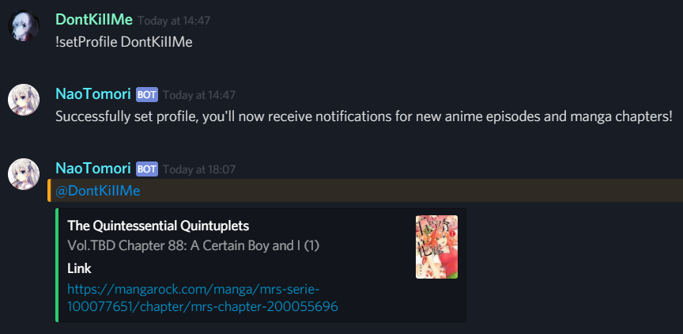

# Nao Tomori

[](https://travis-ci.org/ZhongXiLu/NaoTomori)

Basic [Discord](https://discordapp.com/) bot that pings you when a new anime episode or manga chapter is released, based on your [MyAnimeList](https://myanimelist.net/) account. I couldn't find any bot that does this, so I wrote one my own.

This is just a personal bot, meaning it only servers one user at a time, so feel free to use it for yourself.

Currently it supports following sources:
- Anime:
    - [GoGoAnime](https://www4.gogoanime.io/) (default)
    - [9anime](https://www1.9anime.nl/home) (does not work on [Heroku](https://www.heroku.com/))
- Manga:
    - [MangaRock](https://mangarock.com/)

## Example Usage




## Setup

### Local Setup

1. Set up Discord application:
    - Go to https://discordapp.com/developers/applications/me
    - Create a new application
    - Make sure you save the bot token for in step 3
    - You can generate an invite link of your bot at the OAuth2 URL Generator section
2. Set up [Postgresql](https://www.postgresql.org/) database
    ```bash
    sudo -i -u postgres
    $ createuser <USER> -P --interactive
    $ createdb naotomori
    ```
    Also export the configuration as:
    ```bash
    export DATABASE_URL="dbname='naotomori' user=<DB_USER> host='localhost' password=<DB_PASSWORD>"
    ```

3. Set up bot (make sure you are using python3.7 or greater):
    ```bash
    pip install -r requirements.txt
    export DISCORD_CLIENT_TOKEN=<TOKEN>
    python main.py
    ```

### Heroku Setup

Alternatively, you can use [Heroku](https://www.heroku.com/) to host the discord bot for free, there are already config files present, so the deployment should be easy:

1. Sign up for a [Heroku](https://signup.heroku.com/) account if you haven't already
2. Create a new app
3. Set the `DISCORD_CLIENT_TOKEN` in the config vars in your settings
4. Add the [Heroku Postgres ](https://elements.heroku.com/addons/heroku-postgresql) plugin
5. Choose a deployment method (I connected directly to this GitHub repository) and **deploy**
6. Start your worker in the 'Resources' tab
7. That's it! Your discord bot should be running 24/7 (it actually only runs 550 hours a month if you have the 'free' version, but you can increase this to 1000 hours if you link your credit card, making it run the entire month)

## Tests

Run all unit tests:
```bash
python -m unittest -v
```
